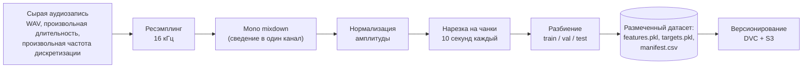
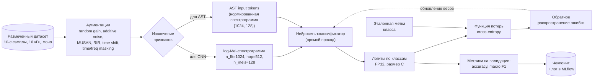

# САВОС — обучающий контур

Репозиторий обучения моделей для проекта **САВОС** (Система Акустического Восприятия для автономных транспортных средств). Содержит:

- пайплайн подготовки и предобработки звуковых датасетов (UrbanSound8K, ESC-50, FUSS, целевой датасет дорожных событий Фурлетова, 17 классов);
- модели классификации значимых акустических событий (свёрточная сеть и Audio Spectrogram Transformer);
- модели разделения источников (SuDoRM-RF, TF-GridNet) — исследовательский контур для следующей итерации;
- скрипты экспорта обученных моделей в ONNX для последующей интеграции в сервер инференса triton_server_autodition.

Отделение инференсной части от обучающей сделано сознательно: данный репозиторий целиком про обучение и эксперименты, а боевой инференс крутится в Triton-сервере отдельным репозиторием.

---

## Подготовка датасета

Сырая запись каждого класса (длинный WAV, переменная длительность) приводится к единому формату и нарезается на 10-секундные обучающие сэмплы. Версионирование данных и чекпоинтов выполняется через DVC, удалённое хранилище — Yandex Object Storage.



Конкретные параметры на стрелках:

- частота дискретизации после ресэмплинга — **16 кГц**;
- длина одного обучающего сэмпла — **10 секунд** (160 000 отсчётов);
- количество каналов после mixdown — **1 (моно)**;
- разбиение train/val/test выполняется по ключам, чтобы фрагменты одной длинной записи не оказались одновременно в train и в test.

---

## Цикл обучения классификатора

Обученная модель получает на вход 10-секундный одноканальный сэмпл и выдаёт распределение вероятностей по классам значимых акустических событий. Параметры модели обучаются методом стохастического градиентного спуска по функции потерь cross-entropy.



В качестве классификатора в проекте используются две архитектуры:

- **CNN** — свёрточная нейросеть (baseline по ТЗ), обучается с нуля.
- **AST** — Audio Spectrogram Transformer (`MIT/ast-finetuned-audioset-10-10-0.4593`), предобученный на AudioSet, дообучается на целевом датасете. Основная продакшен-модель проекта.

Каждая архитектура обучается независимо на двух датасетах: публичном UrbanSound8K (10 классов) и целевом датасете дорожных акустических событий (17 классов). Качество измеряется на отдельной тестовой выборке.

---

## Запуск обучения

```bash
# окружение
conda create -n autodition python=3.10
conda activate autodition
pip install -r requirements.txt

# обучение с конкретным экспериментом из configs/experiment/
python src/train.py experiment=fruletov_ast_finetune
python src/train.py experiment=us8k_ast_finetune
python src/train.py experiment=fruletov_cnn_baseline
python src/train.py experiment=us8k_cnn_baseline

# оценка обученной модели на тестовой выборке
python src/eval.py ckpt_path=logs/train/runs/<run-id>/checkpoints/best.ckpt
```

Все эксперименты управляются через Hydra-конфиги в [configs/experiment/](configs/experiment/); любой параметр можно переопределить из командной строки:

```bash
python src/train.py experiment=fruletov_ast_finetune \
    trainer.max_epochs=30 \
    data.batch_size=32 \
    model.optimizer.lr=5e-5
```

---

## Экспорт обученной модели в ONNX

```bash
python scripts/export_classification_onnx.py \
    --ckpt logs/train/runs/<run-id>/checkpoints/best.ckpt \
    --out furletov_ast_finetune_tuned.onnx
```

Получившийся `.onnx`-файл размещается в `model_repository/classifier_*/1/model.onnx` соответствующего класификатора в репозитории triton_server_autodition.

---

## Структура репозитория

```
configs/                  Hydra-конфиги (data, model, experiment, trainer, ...)
data/                     Версионируемые через DVC датасеты
notebooks/                EDA и preprocessing-пайплайны
scripts/                  Скрипты препроцессинга, экспорта в ONNX, версионирования
src/
├── data/                 Загрузка, аугментации, схемы, коллатор
├── models/               Композиция нейросетевых моделей, лоссы, метрики
├── utils/                Вспомогательные модули, инстанциация, версионирование
├── train.py              Точка входа обучения
└── eval.py               Точка входа оценки модели
tests/                    pytest smoke-tests
schemas/                  Схемы архитектуры обучающего контура (dot/svg/png)
```

---

## Стек технологий

Репозиторий построен на базе шаблона [Lightning-Hydra-Template](https://github.com/ashleve/lightning-hydra-template):

- [PyTorch Lightning](https://github.com/PyTorchLightning/pytorch-lightning) — управление циклом обучения;
- [Hydra](https://github.com/facebookresearch/hydra) — иерархическая композиция конфигов экспериментов;
- [DVC](https://dvc.org) — версионирование датасетов и чекпоинтов;
- [MLflow](https://mlflow.org) — логирование экспериментов;
- [ONNX Runtime](https://onnxruntime.ai) — формат экспорта обученных моделей для интеграции в сервер инференса.
